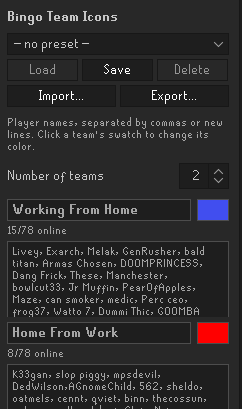
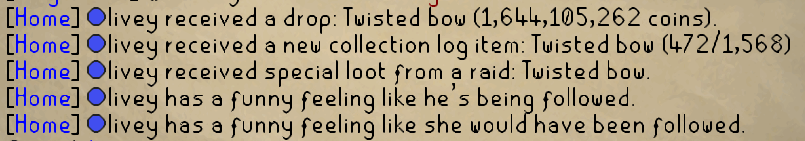
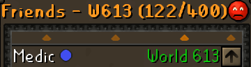
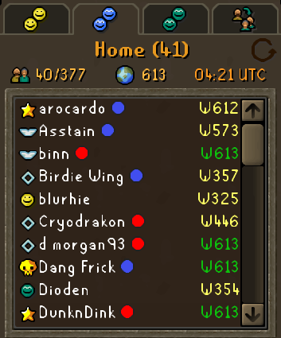
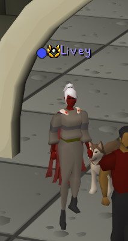

# Bingo Team Icons

A RuneLite plugin for bingo and clan events. Sort players into teams, give each
team a colour, and a matching badge appears next to their name everywhere the
game shows it — chat, the friends list, the clan member lists, and above their
heads.

## Screenshots

## Where icons appear

- **Chat** — public chat, friends chat, clan chat (including guest clan and group
  ironman), and private messages, sent and received.
- **Clan broadcasts** — drops, new collection log items, raid special loot, and
  pets, in your own clan, a guest clan, and group ironman broadcasts. The badge
  goes next to the player's name inside the announcement.
- **Friends list** — to the right of each name.
- **Clan member lists** — in both the clan and guest clan side panels.
- **Above players' heads** — at the overhead name position, so it pairs with
  Player Indicators' overhead names.

Chat badges are always on; the other four each have their own toggle in the
plugin's settings (the gear icon). See [Settings](#settings).

## Setting up teams

1. Enable the **Bingo Team Icons** plugin.
2. Open the **Bingo Team Icons** sidebar panel (the small four-colour grid icon).
3. Pick the **number of teams** (1–10) — a section appears for each team.
4. Paste each team's player names into its box, separated by commas or new lines.
5. Optionally name each team, and click its colour swatch to change its badge
   colour.

Each team's header shows how many of its players are currently online — counting
everyone visible in your clan channel, guest clan channel, and friends chat.

Icons update immediately, including on messages already in your chat history.
Names are matched case-insensitively, a name listed on two teams counts for the
lower-numbered one, and lowering the team count keeps the hidden teams' rosters
saved in case you raise it again.

## Sharing teams with an event

Rather than asking everyone in a bingo to paste each roster by hand, one organiser
can set the teams up once and share them.

- **Export** turns your teams into a single code. Copy it into Discord, or use
  **Save to file** to share a small `.bti` file instead.
- **Import** takes that code — pasted, or loaded from a file — shows you what it
  contains, and lets you either **replace** your teams with it or **merge** it into
  the ones you already have. Merging matches teams by name, keeps your own colours,
  and never drops a team silently. If the code is named, you are offered the chance
  to keep it as a preset.
- **Presets** save a whole set of teams under a name so you can switch between
  events later. You can keep up to 20. Presets are stored with your RuneLite
  settings, so they follow you between machines.

Everything happens on your own machine — no server is involved, and nothing about
you or your clan is uploaded anywhere. A code is simply your rosters compressed and
encoded. Around 200 players fits in one Discord message; larger events (700 players
is roughly 5,000 characters) should be shared as a file, since player names are
close to random and do not compress much further.

## Settings

All four are on by default.

| Setting | What it turns off |
| --- | --- |
| Overhead icons | Badges above players' heads |
| Friends list icons | Badges on the friends list |
| Clan member list icons | Badges in the clan and guest clan member lists |
| Broadcast icons | Badges on collection log and drop broadcasts |
